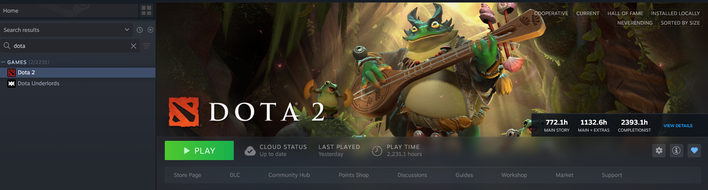
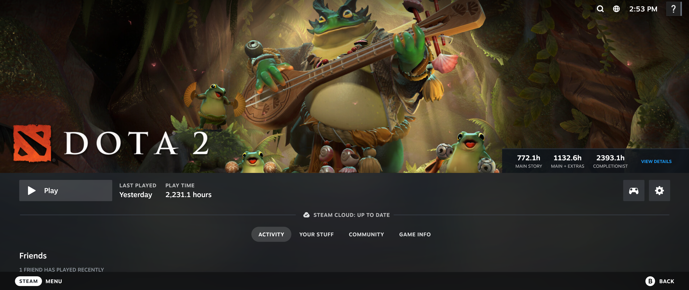

# HLTB for Steam

A [Millennium](https://steambrew.app/) plugin that displays [How Long To Beat](https://howlongtobeat.com/) completion times on game pages in the Steam library.

## Features

- Shows HLTB completion times directly on game pages:
  - Main Story
  - Main + Extras
  - Completionist
- Works in both Desktop and Big Picture modes
- Caches results locally, optionally clear via the settings page
- Click "View Details" to open the full HLTB page

## Requirements

- [Millennium](https://steambrew.app/) installed on Steam
- Windows or Linux

## Installation

### From Millennium (Recommended)

1. Open Steam with Millennium installed
2. Go to Settings > Plugins
3. Select "HLTB for Steam"
4. Copy the plugin ID and install via Millenium in Steam
5. Enable the plugin

### Manual Installation

1. Download the latest release from the [Releases](../../releases) page
2. Extract the contents to your Steam plugins folder:
   - Windows: `C:\Program Files (x86)\Steam\plugins\hltb-for-millennium\`
   - Linux: `~/.steam/steam/plugins/hltb-for-millennium/`
3. Restart Steam

## Usage

Once installed, HLTB data automatically appears on game pages in your Steam library. Simply click on any game to see its completion times displayed on the header image.

## How It Works

1. When you view a game page, the plugin detects the Steam App ID
2. The Lua backend queries the Steam API to get the game name
3. It searches How Long To Beat for matching games
4. Results are cached locally and displayed on the game header

There is a settings page where you can view the current cache stats or clear the cache, mainly useful for testing.

HLTB uses name based search, and often times the name in HLTB does not match Steam. Most of the time it just works. Occasionally it does not, and so there is a [name fixes](./backend/name_fixes.lua) file. If anything bugs you enough then just submit a PR.

## Known Limitations

- Games not in the HLTB database will show placeholder dashes
- Some games may not match correctly due to name differences between Steam and HLTB
- DLC and non-game content will not have HLTB data

## Development

See the [development docs](./docs/README.md).

## Credits

- [HLTB for Deck](https://github.com/morwy/hltb-for-deck/) for inspiration
- [How Long To Beat](https://howlongtobeat.com/) for the game completion data
- [Millennium](https://steambrew.app/) for the plugin framework
- [HowLongToBeat-PythonAPI](https://github.com/ScrappyCocco/HowLongToBeat-PythonAPI) for HLTB API reference implementation

## Disclaimer

This plugin is not affiliated with, endorsed by, or connected to How Long To Beat or HowLongToBeat.com. All game data is sourced from their public website.

## License

MIT
